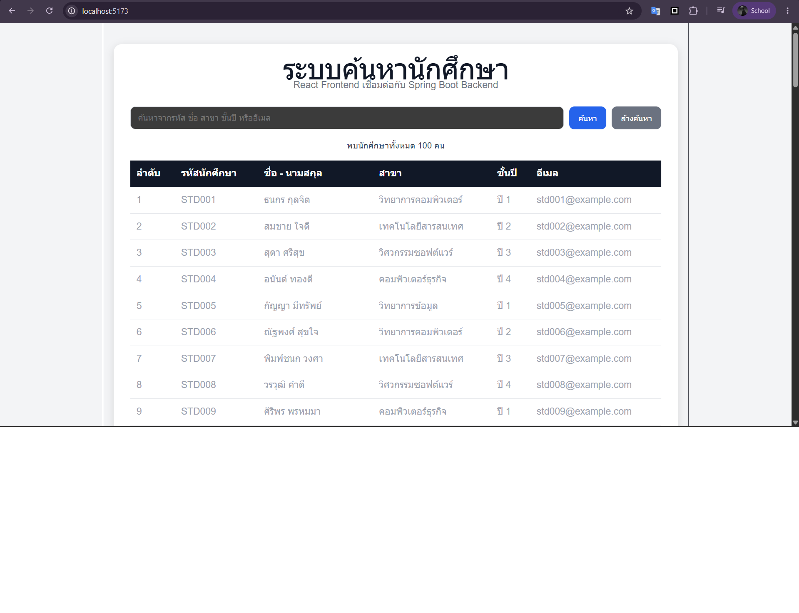

# Simple Student Information Search System

ระบบค้นหาข้อมูลนักศึกษาอย่างง่าย พัฒนาด้วย React และ Spring Boot  
ภายในระบบมีข้อมูลนักศึกษา 100 คน และสามารถค้นหาจากรหัสนักศึกษา ชื่อ สาขา ชั้นปี และอีเมลได้

## ภาพตัวอย่างระบบ



## เทคโนโลยีที่ใช้

### Frontend

- React
- Vite
- JavaScript
- CSS

### Backend

- Java
- Spring Boot
- Spring Web
- Maven

## โครงสร้างโปรเจค

```text
student-search-system
├── backend
│   └── Spring Boot REST API
├── frontend
│   └── React
├── images
│   └── student-search-page.png
└── README.md
```

## API

แสดงนักศึกษาทั้งหมด:

```http
GET http://localhost:8080/api/students
```

ค้นหานักศึกษา:

```http
GET http://localhost:8080/api/students?keyword=ธนกร
```

ดูนักศึกษาตาม ID:

```http
GET http://localhost:8080/api/students/1
```

## วิธีรัน Backend

```bash
cd backend
.\mvnw.cmd spring-boot:run
```

Backend จะทำงานที่:

```text
http://localhost:8080
```

## วิธีรัน Frontend

```bash
cd frontend
npm install
npm run dev
```

Frontend จะทำงานที่:

```text
http://localhost:5173
```

## ความสามารถของระบบ

- แสดงนักศึกษา 100 คน
- ค้นหาจากรหัสนักศึกษา
- ค้นหาจากชื่อและนามสกุล
- ค้นหาจากสาขา
- ค้นหาจากชั้นปี
- ค้นหาจากอีเมล
- เชื่อมต่อ React กับ Spring Boot REST API
